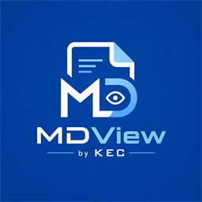

# MDView · by KEC

<p align="center">
  
</p>

A **live-WYSIWYG Markdown editor** for Windows. You type Markdown and it renders
**in place** as you type — no split-pane preview, no visible raw syntax. Built as
a native desktop app with Electron.

**MDView by KEC** · MIT License · © 2026 KEC

<p align="center">
  <a href="https://github.com/kwokhow/MDView/releases/latest">Download the latest release</a>
</p>

---

## For users

### Download & install
Grab a build from the **[Releases page](https://github.com/kwokhow/MDView/releases/latest)**:

| File | What it is |
| --- | --- |
| `MDView Setup 1.0.0.exe` | NSIS installer (~85 MB). Installs the app, creates a Start-menu/desktop shortcut, and registers `.md` / `.markdown` files so you can double-click or "Open with" MDView. |
| `MDView-1.0.0-portable.exe` | Single self-contained executable (~85 MB). No install — just run it. (Does not register file associations.) |

> The executables are **unsigned** (no paid code-signing certificate), so Windows
> SmartScreen may show a "Windows protected your PC" prompt on first run — choose
> **More info → Run anyway**. This is normal for open-source apps without a
> commercial signing certificate.

### Editing
Type Markdown and watch it render live: `## ` → heading, `**x**` → **bold**,
`*x*` → *italic*, `` `x` `` → `code`, `- [ ] ` → a task checkbox, `> ` → a
quote, ` ``` ` → a code block with syntax highlighting. GFM tables, task lists,
images, and links all work.

### Keyboard shortcuts
| Shortcut | Action |
| --- | --- |
| Ctrl + N | New document |
| Ctrl + O | Open a file |
| Ctrl + S | Save |
| Ctrl + Shift + S | Save As |
| Ctrl + F | Find in document |
| Ctrl + / | Reading mode (read-only) |
| Ctrl + \ | Toggle light / dark theme |
| Ctrl + = / − / 0 | Zoom in / out / reset |
| Ctrl + Z / Y | Undo / redo |

Closing the window with unsaved changes prompts **Save / Don't Save / Cancel**.
Window size, theme, and recent files persist between sessions.

### About
**Help → About MDView** shows the version, a short description, and the KEC
attribution. The app icon, taskbar entry, and installer all carry the MDView
by KEC branding.

---

## For developers

### Stack
- **Electron** (main / preload / renderer) + **electron-vite** + **TypeScript**
- **Milkdown Crepe** (`@milkdown/crepe`) — the ProseMirror-based WYSIWYG engine.
  Owns Markdown parsing, rendering, serialization, and CodeMirror-powered code
  blocks.
- **electron-store** — persists window geometry + theme.
- **electron-builder** — packages the NSIS installer + portable exe.

### Commands
```bash
npm install        # install dependencies
npm run dev        # launch in dev mode with hot reload
npm run build      # production build into out/
npm run typecheck  # tsc --noEmit for main+preload and renderer
npm run dist       # build + package installers into release/
npm run dist:dir   # build + package unpacked app only (faster, no installer)
node scripts/make-icon.cjs   # regenerate build/icon.ico + icon.png
```

### Project layout
```
src/
├─ main/            # Node side — owns the filesystem and OS integration
│  ├─ index.ts        app lifecycle, window, single-instance, close guard, CLI file arg
│  ├─ menu.ts         application menu + accelerators → menu:command IPC
│  ├─ ipc.ts          ipcMain handlers wiring renderer requests to files/settings
│  ├─ files.ts        fs/promises read/write + open/save dialogs + recent docs
│  └─ settings.ts     electron-store: window bounds + theme
├─ preload/
│  ├─ index.ts        contextBridge → window.api (only named, typed methods)
│  └─ index.d.ts      global Window typing
├─ renderer/        # Browser side — owns the editor and UI
│  ├─ main.ts         bootstrap, command dispatch, file ops, dirty tracking
│  ├─ editor.ts       MarkdownEditor: thin wrapper over Crepe (load/getMarkdown)
│  ├─ document.ts     immutable DocumentState (path/name/dirty)
│  ├─ theme.ts        light/dark Crepe theme swap
│  ├─ find.ts         in-document find via CSS Custom Highlight API
│  ├─ index.html
│  └─ styles/app.css  app chrome (find bar, status bar, reading column)
└─ shared/types.ts  IPC channel constants + the MdViewApi contract
```

### Architecture notes
- **Security:** `contextIsolation: true`, `nodeIntegration: false`. The renderer
  has no Node access; every disk/OS action goes through the narrow `window.api`
  bridge defined in `src/shared/types.ts` and implemented in `src/main/ipc.ts`.
- **Process split:** main owns all filesystem and dialog access; the renderer
  only holds editor state and calls back through IPC. Menu items live in main and
  push `menu:command` events to the renderer so shortcuts and clicks share one
  code path.
- **Find** uses the CSS Custom Highlight API instead of wrapping matches in
  `<span>`s — wrapping nodes would corrupt ProseMirror's view reconciliation.
- **Immutability:** the current document is an immutable `DocumentState`; every
  change returns a new object (`src/renderer/document.ts`).
- **Crepe `getMarkdown()` guard:** a known Crepe bug throws when serializing a
  fenced code block with no language; `MarkdownEditor.getMarkdown()` falls back
  to the last value seen from change events.
- **Resilient startup:** `init()` wraps `getTheme()` in try/catch so a settings
  failure can never block the editor from mounting.

### Packaging note
`electron-builder` downloads tool binaries (winCodeSign, NSIS) from GitHub on
first run into `%LOCALAPPDATA%\electron-builder\Cache`. The winCodeSign archive
contains macOS `.dylib` **symlinks** that fail to extract on Windows without
Developer Mode/admin — these are macOS-only and irrelevant to a Windows build.
If the build stalls there, manually extract one copy into the canonical
`winCodeSign\winCodeSign-2.6.0\` folder (ignoring the 2 symlink errors) using
`node_modules/7zip-bin/win/x64/7za.exe`, then re-run.

---

## License
MIT.
